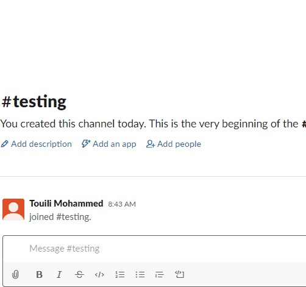

<h1 align="center">[Ruby] Capstone Project / Slack Bot</h1>
<p>
  
  <a href="#" target="_blank">
    
  </a>
  <a href="https://twitter.com/MohammedTouili " target="_blank">
    
  </a>
</p>

## Description of the project 

>The purpose of this project is to implement a Slack bot that searches for news articles related to the search query

## Built with
<ul>
  <li>Ruby (slack-ruby-bot gem)</li>
</ul>

## Dev Environment Requirement:

### Getting API Keys

Before running the code you need both Slack Api Key ("config/.slackbot") and News Api Key ("config/.news") To get these check the following links:
- [Slack](https://my.slack.com/services/new/bot)
- [News API](https://newsapi.org/account)

After getting both API Keys, create a file for each key inside _config_ folder while following the naming sited below:
- **_.news_** for the News API Key
- **_.slackbot_** for the Slack Bot API Key

Paste each API Key inside the related file

### Installing Dependencies

_(If you have **Bundler** installed "To Check if **Bundler** is installed, run this command **_bundle -v_**, if you get **_Bundler version 2.x.x_**", please skip to the next step!)_
> To install **Bundler** run this command:
```
  gem install bundler
```
_(If you have **Rake** installed "To Check if **Rake** is installed, run this command **_rake -V_**, if you get **_rake, version 13.x.x_**", please skip to the next step!)_
> To install **Rake** run this command:
```
  gem install rake
```
Now, you are ready to install the _Gemfile_ dependencies. Run the following command and you are good to go:
```
  bundle install 
```

## ⭐️ Running the code
Inside The project Repository run the following command:
```
    rake deploy:run
```
## ⭐️ Testing the code with RSpec
Inside The spec directory run the following command:
```
> rspec bot_spec.rb
```
## ⭐️ Bot Instructions
1. Choose/Create a channel on slack

2. Invite the bot using the slash command "/invite @botname"

3. "@botname help" for further instructions

   ### bot Test
   

   

## Author

👤 **Mohammed TOUILI**
 
* Github: [@simoxsimo](https://github.com/https:\/\/github.com\/simoxsimo)
